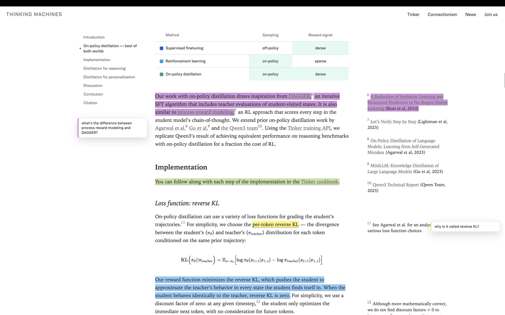

<p align="center">
  
</p>

# highlighter

A small browser extension for highlighting text and keeping private comments on webpages. Notes are stored in the browser's local extension storage, so there is no account or server.

<p>
  <a href="https://example.com/highlighter-chrome.zip">Download now for Chrome</a>
</p>



## Install

Download the Chrome package, unzip it, then:

1. Open `chrome://extensions`.
2. Enable Developer mode.
3. Click Load unpacked.
4. Select the unzipped `highlighter` folder.

## Use

Select text on a webpage, then choose Highlight or Comment from the small toolbar. Click any highlight to edit its comment, change its color, or delete it. The extension popup shows all highlights for the current page, can clear them, and can disable highlighter on the current domain.

For local files, enable Allow access to file URLs for the extension from `chrome://extensions`.

## Privacy

Privacy policy: https://akshith.io/highlighter-privacy-policy

## License

MIT

## Development

Runtime files live in `dist/`. Source files live in `src/` and are written in TypeScript, with Tailwind CSS entry points in `src/styles/`.

After installing dependencies, rebuild with:

```sh
npm run build
```

Build the Chrome Web Store upload package with:

```sh
npm run package
```

The repo also installs a pre-commit hook with `npm install`. When committing, it rebuilds `highlighter-chrome.zip`, stages it, stages any rebuilt `dist/` files, and continues with the same commit message.
<br />

&nbsp; happy note-taking! 📝 - may 2026 
